# Stablecoin Route Optimization Engine

A production-grade optimization system for enterprise stablecoin and fiat payment routing that minimizes transaction costs, reduces settlement times, and maximizes liquidity efficiency through AI-powered insights and mathematical optimization.

## 🎯 Project Objective

To optimize enterprise-level stablecoin and fiat payment routing, minimize costs, and improve liquidity efficiency for Roma's clients. The system leverages AI and optimization algorithms to provide actionable insights and automation across treasury operations.

## 🚀 Live Demo

- **API Documentation**: [https://stablecoin-optimizer.onrender.com/docs](https://stablecoin-optimizer.onrender.com/docs)
- **Interactive Dashboard**: [https://stablecoin-optimizer-dashboard-41a3.onrender.com/](https://stablecoin-optimizer-dashboard-41a3.onrender.com/)

## 📊 System Architecture

The system employs a modular, production-ready architecture designed for scalability and extensibility:

### Core Components

1. **Data Ingestion Layer**
   - Generates realistic transfers with business context (vendor payments, remittances, payroll)
   - Production-ready for integration with Roma APIs for real payment and treasury data

2. **Data Normalization Engine**
   - Maps transaction types, business context, urgency, and user constraints to standardized transaction weights
   - Creates unified transfer format across cost, time, and risk dimensions

3. **Optimization Engine**
   - Single algorithm solving for optimal routing: **Minimize α·cost + β·time + γ·risk**
   - Implemented using Mixed Integer Programming (MIP) with PuLP solver
   - Handles hard constraints: maximum cost, settlement time, and slippage thresholds
   - Context-aware flags: cross-border, high-value, fast settlement requirements

4. **Treasury Analytics Layer**
   - Real-time computation of KPIs: idle capital ratio, FX exposure, liquidity buffer utilization
   - Time-series analysis for performance trending

5. **AI Insight Engine**
   - Fine-tuned LLM model for treasury intelligence
   - Generates operational summaries, anomaly detection, and strategic recommendations
   - Auto-generates compliance notifications and incident reports

6. **Visualization Layer**
   - Interactive dashboard (Streamlit/React) for KPI monitoring
   - Real-time optimization results and treasury state visualization

### Data Flow Architecture

```mermaid
flowchart TD
    %% === 1. RAW INPUTS ===
    subgraph INGEST["1. RAW INPUTS"]
        A1[Stablecoin API] --> N
        A2[CSV / Webhook / ERP / Synthetic] --> N
    end

    %% === 2. NORMALIZER ===
    subgraph NORM["2. NORMALIZER"]
        N["Normalizer: Transaction dataclass / clean fields / types"]
    end

    %% === 3. ADAPTER ===
    subgraph ADAPT["3. ADAPTER"]
        AD["Adapter: enrich with candidate routes / weights / pre-checks"]
    end

    %% === 4. OPTIMIZER ===
    subgraph OPT["4. OPTIMIZER"]
        O["Optimizer: MIP solver (α·cost + β·time + γ·risk)"]
        O2["Hard constraints: (max cost, max time, max slippage)"]
        O3["Context flags: (cross-border, high-value, fast settlement)"]
    end

    %% === 5. TREASURY ANALYTICS ===
    subgraph ANALYTICS["5. TREASURY ANALYTICS"]
        AN["KPI timeseries / idle capital / FX exposure"]
    end

    %% === 6. AI INSIGHTS ===
    subgraph AI["6. AI INSIGHTS"]
        AIo["Summaries / anomalies / recommendations"]
    end

    %% === 7. DASHBOARD ===
    subgraph DASH["7. DASHBOARD"]
        D["Streamlit / React UI"]
    end

    %% === Flow connections ===
    A1 --> N
    A2 --> N
    N --> AD
    AD --> O
    O --> AN
    AN --> AIo
    AIo --> D
```



**Pipeline Summary:**
```
Raw Inputs (Roma API, CSV, Webhooks)
    ↓
[Normalizer] → Uniform schema (Transaction)
    ↓
[Adapter] → Enrichment & reshaping (Transfer)
    ↓
[Optimizer] → MIP solver with AI logic
    ↓
[Analytics / Dashboard] → KPIs & insights
```

## 🗄️ Data Model

### Core Entities

- **Transaction**: Amount, currency, source, destination, rail options, fee estimates, SLA parameters
- **Route**: Possible paths across stablecoin rails, fiat rails, and custodial accounts
- **TreasuryState**: Holdings per asset, available liquidity, target buffer ratios
- **RiskEvent**: Anomaly logs detected by AI Ops assistant

All data is stored locally in the prototype with seamless integration paths for Roma's API infrastructure in production deployment.

## ⚙️ Optimization Logic

### Objective Function

Minimize total transaction cost and expected settlement delay while satisfying liquidity and compliance constraints:

**Minimize: α·cost + β·time + γ·risk**

### Constraints

- Each transaction routed via exactly one valid route
- Liquidity per asset maintained above minimum threshold
- Settlement SLA within defined limits
- Stablecoin/fiat conversions respect regulatory availability by region

**Output**: Routing matrix with cost, time, and risk scores per route

## 🤖 AI Integration

The AI Ops Assistant leverages prompt-engineered LLM modules to:

- Summarize daily treasury performance and highlight anomalies
- Suggest optimal rebalancing moves and routing policy updates
- Auto-generate compliance notifications and incident summaries
- Provide contextual operational intelligence

This component demonstrates an AI-first operational approach applied to treasury ecosystem management.

## 🛠️ Tech Stack

| Layer | Technology |
|-------|-----------|
| **Backend** | Python (Pandas, PuLP, FastAPI) |
| **Optimization** | Mixed Integer Programming (MIP) solver |
| **Dashboard** | Streamlit |
| **Database** | SQLite (prototype), PostgreSQL (production-ready) |
| **Caching** | Redis |
| **LLM Integration** | OpenAI API |
| **Deployment** | Docker containerization |
| **API Documentation** | OpenAPI/Swagger |

## 📈 KPIs and Success Metrics

- **Average payout cost reduction** (%)
- **Settlement time improvement** (%)
- **Treasury idle capital reduction** (%)
- **Automated issue resolution rate** (%)
- **API uptime and response latency**

---

## 🚦 Getting Started

### Prerequisites

- Python 3.9 or higher
- pip (Python package manager)
- Docker & Docker Compose
- Git
- OpenAI API key

### Installation

#### 1. Clone Repository

```bash
mkdir stablecoin-optimizer
cd stablecoin-optimizer
```

#### 2. Create Virtual Environment

```bash
# Create virtual environment
python -m venv venv

# Activate virtual environment
# macOS/Linux:
source venv/bin/activate
# Windows:
venv\Scripts\activate
```

#### 3. Install Dependencies

```bash
# Upgrade pip
pip install --upgrade pip

# Install requirements
pip install -r requirements.txt
```

#### 4. Configure Environment

```bash
# Copy environment template
cp .env.template .env

# Edit with your API keys
nano .env
```

**Required Configuration:**

```bash
# REQUIRED
OPENAI_API_KEY=sk-your-actual-openai-key-here

# OPTIONAL (for enhanced features)
GOOGLE_API_KEY=your-google-key-here
ANTHROPIC_API_KEY=your-anthropic-key-here

# Application settings
LOG_LEVEL=INFO
CACHE_TTL_SECONDS=30
```

#### 5. Start Redis

```bash
docker compose up
```

#### 6. Generate Sample Data

```bash
python main.py
```

**Output:**
- `config/generated_transfers.csv` (100 sample transfers)
- `config/normalized_transactions.csv` (100 normalized transfers)
- `config/optimization_results.json` (100 optimized routes)

**Expected Summary:**
```
Generated 100 stablecoin transfer records

Summary Statistics:
Average transfer amount: $150,450.23
Average total cost (bps): 32.45
Average settlement time: 245 seconds
Settlement success rate: 92.0%
```

#### 7. Launch Services

```bash
# Start API server
python -m api.orchestrator

# Start dashboard (new terminal)
streamlit run dashboard/dashboard.py
```

#### 8. Verify Installation

**API Endpoints:**
- Swagger UI: [http://localhost:8000/docs](http://localhost:8000/docs)
- ReDoc: [http://localhost:8000/redoc](http://localhost:8000/redoc)

**Dashboard:**
- Streamlit UI: [http://localhost:8501](http://localhost:8501)

---

## ✅ Verification Checklist

- [ ] Virtual environment activated
- [ ] All dependencies installed successfully
- [ ] `.env` file configured with valid API keys
- [ ] Redis container running
- [ ] Sample data generated
- [ ] API server responding
- [ ] Dashboard accessible
- [ ] Swagger documentation loads

---

## 🔧 Development Workflow

### Testing

```bash
# Run all tests
pytest

# Run with coverage
pytest --cov=. --cov-report=html

# Run specific test file
pytest tests/test_optimizer.py
```

---

## 🚀 Production Deployment

### Database Migration

Replace SQLite with PostgreSQL:

```python
from sqlalchemy import create_engine

engine = create_engine(os.getenv('DATABASE_URL'))
```

### Caching Layer

Enable Redis for production performance:

```python
import redis

redis_client = redis.Redis(
    host=os.getenv('REDIS_HOST', 'localhost'),
    port=6379,
    decode_responses=True
)
```

### Parallel Processing

Optimize batch requests:

```python
import asyncio

results = await asyncio.gather(*[
    optimizer.optimize_transfer(req)
    for req in requests
])
```

### Monitoring & Observability

Integrate Prometheus metrics:

```python
from prometheus_client import Counter, Histogram

optimization_requests = Counter(
    'optimizer_requests_total',
    'Total optimization requests'
)

optimization_duration = Histogram(
    'optimizer_duration_seconds',
    'Optimization duration'
)
```

---

**Built with ❤️ for enterprise treasury optimization**